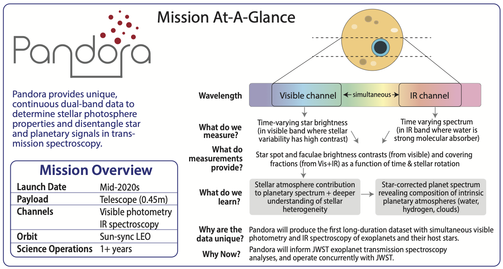
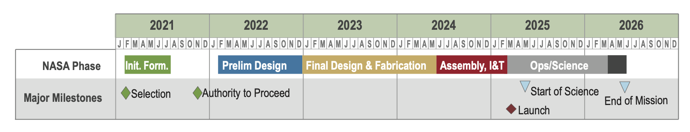
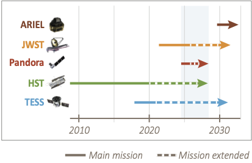
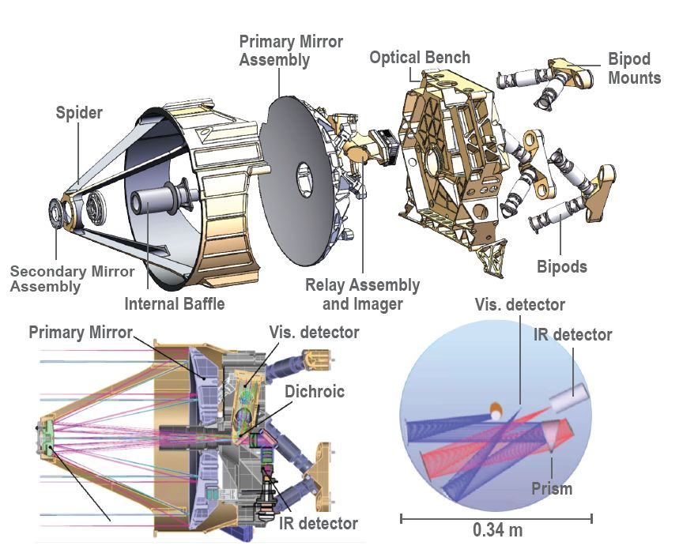

# About Pandora

{: .center}

----
## Science Justification

Transmission spectroscopy is one of the primary ways we learn about the compositions and climates of exoplanets. Stellar brightness variations due to star spots and faculae, however, can contaminate these measurements. Pandora's goal is to disentangle star and planet signals in transmission spectra to reliably determine exoplanet atmosphere compositions. This is broken into two goals:

   - Determine the spot and faculae covering fractions of low-mass exoplanet host stars and the impact of these active regions on exoplanetary transmission spectra.
   - Identify exoplanets with hydrogen- or water-dominated atmospheres, and determine which planets are covered by clouds and hazes.
 
Pandora will observe at least 20 exoplanets over long durations (~10 transits per planet) with sizes ranging from Earth-size to Jupiter-size and host stars spanning mid-K to late-M spectral types.

----
## What is Pandora

The Pandora SmallSat was selected as an inaugural NASA Astrophysics Pioneers mission in 2021, and it will launch in 2025 as a secondary payload in Sun-synchronous low-Earth orbit. It consists of a 0.45-meter telescope and instrumentation for simultaneous near-infrared spectroscopy and visible-light photometry. These wavelengths will provide constraints on the spot and faculae covering fractions of low-mass exoplanet host stars and the impact of these active regions on exoplanetary transmission spectra. 

SmallSats are incredibly valuable for developing the next generation of space mission leaders. By design, Pandora has a diverse team, with over half of the mission leadership roles filled by early-career scientists and engineers.   

----
## Pandora schedule

The Pandora mission will complete the science objectives proposed, archive the data, and publish results within a 5-year timeline. Launch would occur in the mid-2020s, although the precise timeline is dependent on a ride-sharing agreement.

{: .center}

Pandora is expected to operate concurrently with JWST. JWST has four science instruments with modes for observing transiting exoplanets to high precision and longer IR wavelengths; however, stellar contamination will persist for JWST transmission spectra. We anticipate the opportunity for simultaneous observations in which JWST will do short-baseline deep dives and Pandora will provide long-baseline and visible-band observations.

{: .center}

----
## Pandora Payload

{: .center}

The Pandora payload is built around an all-aluminum 0.45-m Cassegrain telescope design. The telescope is designed to address the challenge of procuring high-performing imaging space systems in a ride-sharing form-factor that are low cost and have rapid acquisition. To help address these challenges, the telescope design minimizes space-vehicle dependencies and maximizes customizability of the aft optics to accommodate a variety of optical configurations. Compared to traditional glass optics, aluminum telescopes are more suited to large-scale manufacturing and batch production. Combined with mechanical interfaces that are machined in parallel with optical surfaces, the telescope has a significant cost- and schedule- advantage over other designs.

----
## Publications

### [ADS Library of Pandora Publications](https://ui.adsabs.harvard.edu/public-libraries/bzY__SIcSUany1HECpSyqg)
