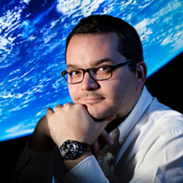

{ class=avatar }
Daniel Apai is an astrophysicist specializing in studies of extrasolar planets with the long-term goal of identifying planetary systems capable of supporting life. He is working on the interface of planetary science and astronomy and holds an appointment as Professor at the Steward Observatory and the Lunar and Planetary Laboratory of The University of Arizona. Daniel is currently the Interim Associate Dean for Research at the College of Science at The University of Arizona. He is the Principal Investigator of the NASA-funded astrobiology team [Alien Earths](https://alienearths.space/) and the [Nautilus Space Observatory](https://nautilus-array.space/) mission concept. 
