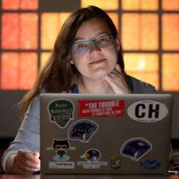

{ class=avatar }
Dr. Jessie Dotson is the Pandora Deputy Principal Investigator.  Dotson has supported a variety of NASA missions in different roles including the SOFIA Instrument Scientist, Director of the Kepler Guest Observer Office, Deputy Science Office Director for Kepler, and the Kepler/K2 Project Scientist. In addition, she served six years as the Branch Chief for Astrophysics at NASA Ames Research Center. Her current areas of research include planetary defense, stellar activity, and exoplanet demographics. 

