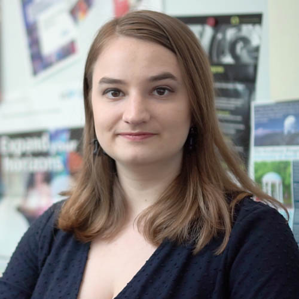

{ class=avatar }
Rae Holcomb is a Ph.D. candidate at the University of California, Irvine, and a current Graduate Student Shadow on the Pandora Mission team. Her research focuses on how to use the intersection of stellar activity studies and radial velocity exoplanet science to improve our understanding of host stars and the planets that orbit them. She has a particular interest in stellar rotation and M dwarf activity. Previously, she developed the open source tool SpinSpotter for identifying rotating stars from photometric surveys, and she is the lead of the TESS Rotation Collaboration, an upcoming community data challenge to improve stellar rotation periods recovered from the TESS sample. With the Pandora team, Rae is designing commissioning software and developing the data reduction pipeline.
