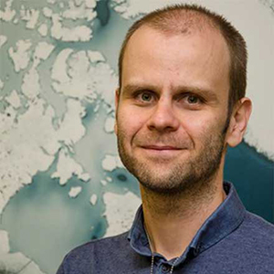

{ class=avatar }
Dr. Veselin Kostov is a research scientist at NASA’s Goddard Space Flight Center and SETI Institute. He is a member of Pandora’s Science Operation Center and is responsible for the development, maintenance and application of Pandora’s scheduling pipeline. Previously, he was a NASA Postdoctoral Fellow at Goddard Space Flight Center and also spent a year as a McLean Postdoctoral Fellow at the University of Toronto’s Department of Astronomy. He received his Ph. D. from the Johns Hopkins University Department of Physics and Astronomy.
 
