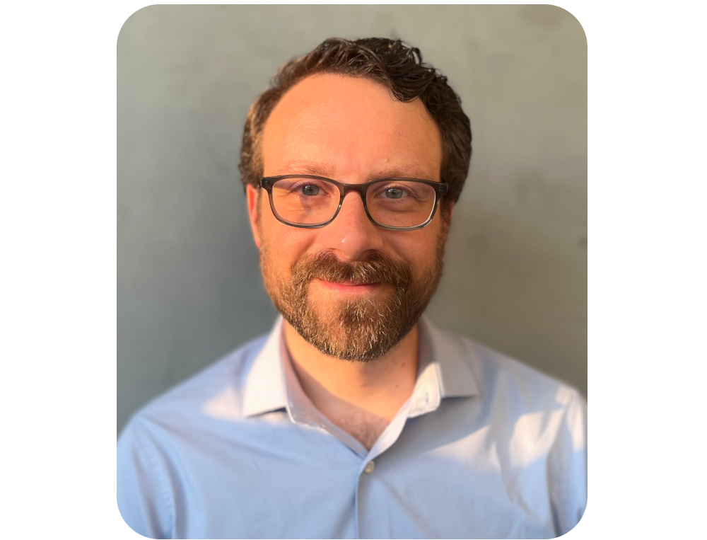

{ class=avatar }
Brett Morris is an astronomer by training, and software engineer at the Space Telescope Science Institute (STScI) in Baltimore, Maryland. At STScI, he contributes to several open-source software projects with the goal of enabling cutting-edge observations of exoplanets and their host stars with JWST, Roman, and beyond. His research develops Bayesian inference techniques to investigate the physics of exoplanet atmospheres via space-based observations, with an emphasis on mitigating confounding signals from stellar atmospheres.
