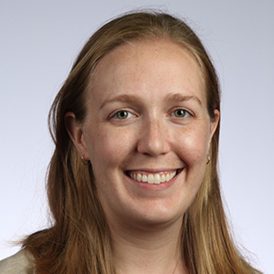

{ class=avatar }
Allison Youngblood is a research astrophysicist at NASA Goddard Space Flight Center focused on characterizing low-mass stars and their activity in the ultraviolet. She leads a large Hubble Space Telescope program to characterize the high-energy radiation of the JWST Cycle 1 transiting exoplanet host stars. She also serves as the deputy project scientist for the TESS mission.
