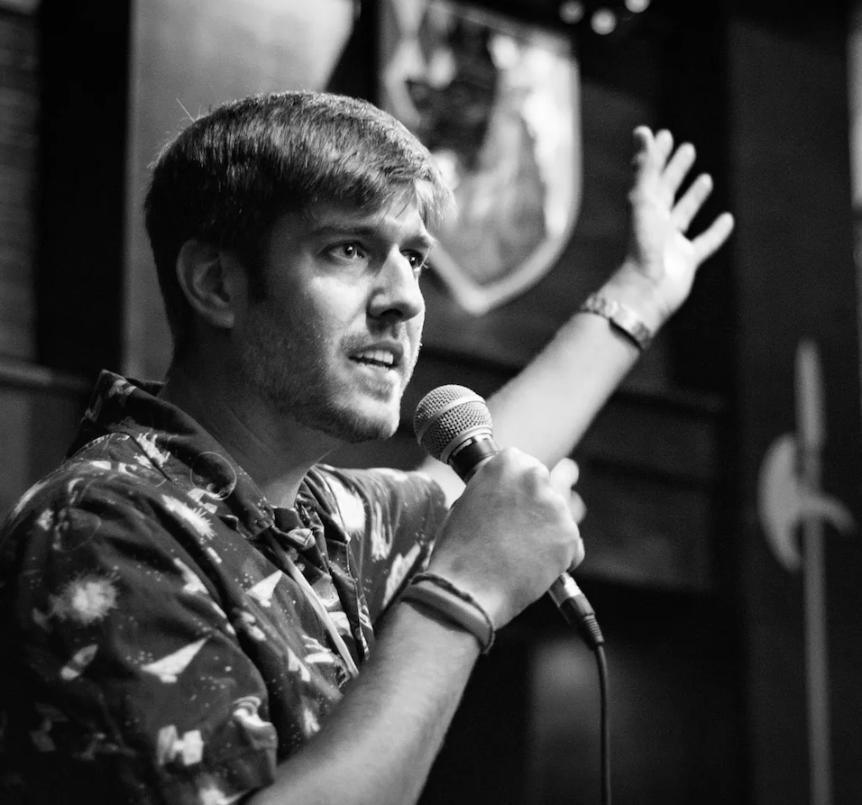

{ class=avatar }

Dr. Rob Zellem is an astrophysicist at NASA’s Goddard Space Flight Center. His research focuses on the characterization of the atmospheres of exoplanets using both the transit and direct imaging methods. He is the Ground-Based Sub-working Group co-lead for Pandora, whereby he is coordinating ground-based observations to support both the operations and scientific interpretation of Pandora data. Rob is also the Deputy Project Scientist for Communications for NASA’s Nancy Grace Roman Space Telescope, the Project Scientist for Exoplanet Watch, a citizen science project to observe transiting exoplanets, a co-lead for NASA’s Nexus for Exoplanet System Science (NExSS), and a science team member for the NASA’s CASE contribution to ESA’s Ariel mission. Previously, Rob worked at NASA’s Jet Propulsion Laboratory where he was a member of the Roman Coronagraph Project Science Team and its Science Calibrations Lead.
