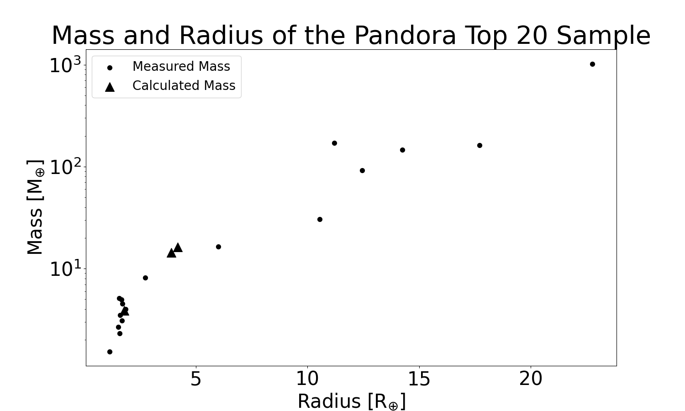

# Pandora Targets

## Target List
The current list of science targets is given below (as of September 4, 2024). The Pandora target list will be updated as the mission launch date approaches.

{{ read_csv('docs/assets/targets_first20_02162024.csv') }}

## Mass-Radius Plot for Pandora Targets

{: .center}

## Secondary Science Targets
A set of 20 secondary targets have also been identified as potential science targets in the case that some of the targets from the primary target list (above) are removed due to observational and mission requirement considerations. This list of secondary targets is given below.

{{ read_csv('docs/assets/targets_second20_02162024.csv') }}
